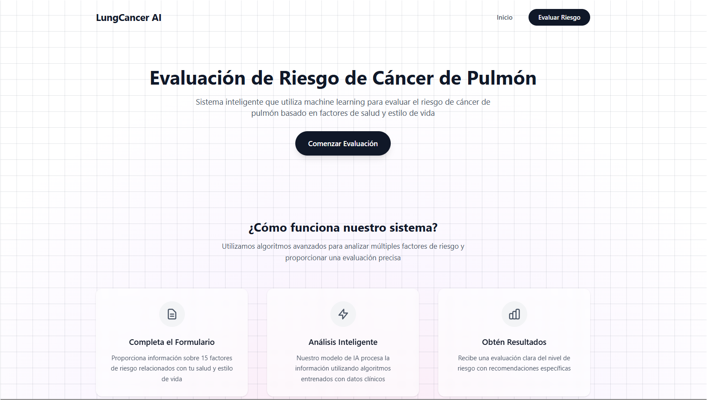
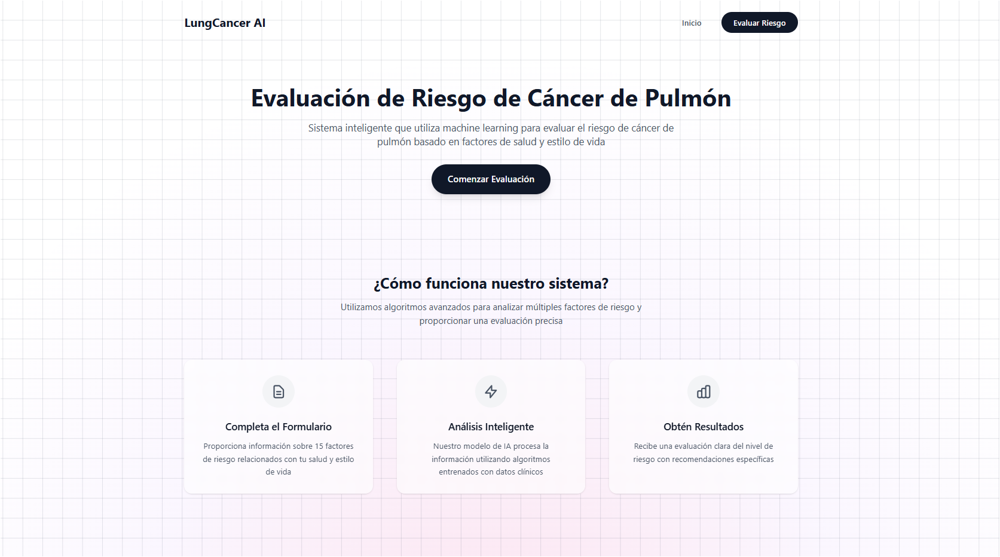
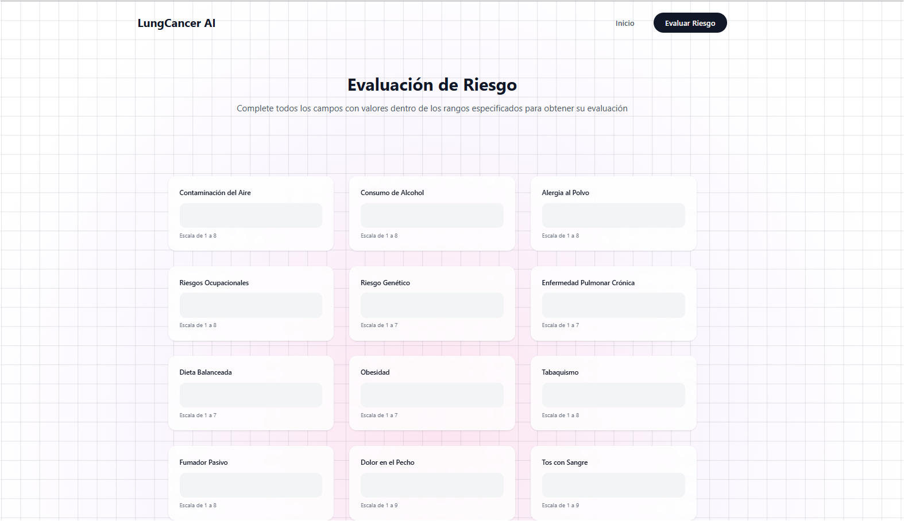
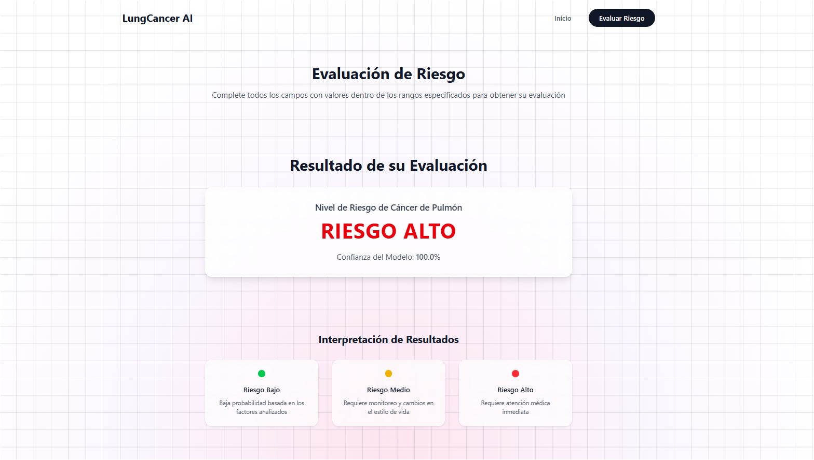

# Sistema de Predicción de Cáncer de Pulmón con IA

Un sistema web profesional que utiliza machine learning para evaluar el riesgo de cáncer de pulmón basado en factores de salud y estilo de vida.



## 📋 Características

- **Análisis basado en 15 factores de riesgo** médicamente validados
- **Modelo de machine learning** entrenado con datos clínicos
- **Interfaz web moderna** y responsive con Tailwind CSS
- **API REST** para integración con otros sistemas
- **Validación de datos** con Marshmallow
- **Resultados inmediatos** con interpretación clara

### Tecnologías Utilizadas

- **Backend**: Flask, PyCaret, Scikit-learn
- **Frontend**: HTML5, Tailwind CSS, JavaScript ES6+
- **Validación**: Marshmallow
- **Machine Learning**: PyCaret con modelos de clasificación
- **Formato de datos**: JSON, Pandas DataFrame

## 🚀 Instalación

### Requisitos Previos

- Python 3.11
- pip
- Git

### Pasos de Instalación

1. **Clonar el repositorio**
   ```bash
   git clone https://github.com/avillaq/lung_cancer_prediction.git
   cd lung_cancer_prediction
   ```

2. **Crear entorno virtual**
   ```bash
   python -m venv .venv
   ```

3. **Activar entorno virtual**
   ```bash
   # En Windows:
   .venv\Scripts\activate
   
   # En Linux/macOS:
   source .venv/bin/activate
   ```

4. **Instalar dependencias**
   ```bash
   pip install -r requirements.txt
   ```

5. **Ejecutar la aplicación**
   ```bash
   python app.py
   ```

La aplicación estará disponible en `http://localhost:5000`

## 💻 Uso del Sistema

### Interfaz Web

1. **Página Principal**: Información general y navegación
   

2. **Formulario de Evaluación**: Entrada de datos del paciente
   

3. **Resultados**: Visualización del nivel de riesgo
   

### Factores Evaluados

El sistema analiza los siguientes 15 factores:

| Factor | Rango | Descripción |
|--------|-------|-------------|
| Contaminación del Aire | 1-8 | Exposición a contaminantes ambientales |
| Consumo de Alcohol | 1-8 | Frecuencia y cantidad de consumo |
| Alergia al Polvo | 1-8 | Sensibilidad a partículas en el aire |
| Riesgos Ocupacionales | 1-8 | Exposición laboral a sustancias nocivas |
| Riesgo Genético | 1-7 | Antecedentes familiares |
| Enfermedad Pulmonar Crónica | 1-7 | Historial de problemas respiratorios |
| Dieta Balanceada | 1-7 | Calidad nutricional de la alimentación |
| Obesidad | 1-7 | Índice de masa corporal |
| Tabaquismo | 1-8 | Frecuencia e intensidad del hábito |
| Fumador Pasivo | 1-8 | Exposición al humo de segunda mano |
| Dolor en el Pecho | 1-9 | Frecuencia e intensidad |
| Tos con Sangre | 1-9 | Presencia de hemoptisis |
| Fatiga | 1-9 | Nivel de cansancio crónico |
| Dificultad para Respirar | 1-9 | Grado de disnea |
| Resfriados Frecuentes | 1-7 | Susceptibilidad a infecciones respiratorias |

## 🔧 API REST

### Endpoint de Predicción

**POST** `/predict`

**Formato de Request:**
```json
[
  {
    "Air_Pollution": 6,
    "Alcohol_use": 2,
    "Dust_Allergy": 4,
    "OccuPational_Hazards": 3,
    "Genetic_Risk": 5,
    "chronic_Lung_Disease": 4,
    "Balanced_Diet": 2,
    "Obesity": 3,
    "Smoking": 5,
    "Passive_Smoker": 4,
    "Chest_Pain": 2,
    "Coughing_of_Blood": 3,
    "Fatigue": 4,
    "Shortness_of_Breath": 5,
    "Frequent_Cold": 3
  }
]
```

**Formato de Response:**
```json
[
  {
    "Air Pollution": 6,
    "Alcohol use": 2,
    "Balanced Diet": 2,
    "Chest Pain": 2,
    "Coughing of Blood": 3,
    "Dust Allergy": 4,
    "Fatigue": 4,
    "Frequent Cold": 3,
    "Genetic Risk": 5,
    "Obesity": 3,
    "OccuPational Hazards": 3,
    "Passive Smoker": 4,
    "Shortness of Breath": 5,
    "Smoking": 5,
    "chronic Lung Disease": 4,
    "prediction_label": 0,
    "prediction_score": 0.7711
  }
]
```

### Interpretación de Resultados

- **0 - Riesgo Bajo**: Baja probabilidad basada en los factores analizados
- **1 - Riesgo Medio**: Requiere monitoreo y cambios en el estilo de vida
- **2 - Riesgo Alto**: Requiere atención médica inmediata

## 📊 Modelo de Machine Learning

### Dataset

El modelo fue entrenado utilizando el [Lung Cancer Dataset](https://www.kaggle.com/datasets/himabindumarpini/lung-cancer-datasets) de Kaggle, que contiene 100,000 registros de pacientes (50K train, 50K test) con 15 características relacionadas con estilo de vida, síntomas e historial médico. El dataset está diseñado para clasificación multi-clase para predecir niveles de riesgo de cáncer de pulmón: 0 = Bajo, 1 = Medio, 2 = Alto.

### Selección del Modelo

Se realizaron comparaciones entre múltiples algoritmos de machine learning para seleccionar el mejor modelo:

| Modelo | Accuracy | F1 | Precision | Recall | AUC |
|--------|----------|----|-----------| -------|-----|
| **Logistic Regression** | **0.97115** | **0.971469** | **0.972003** | **0.971126** | **0.997781** |
| Decision Tree Classifier | 0.97010 | 0.969540 | 0.970258 | 0.969650 | 0.999985 |
| Quadratic Discriminant Analysis | 0.96950 | 0.969583 | 0.970811 | 0.970408 | 1.000000 |
| LGBM Classifier | 0.96000 | 0.960304 | 0.962111 | 0.959432 | 0.991985 |
| XGB Classifier | 0.96000 | 0.960304 | 0.962111 | 0.959432 | 0.998452 |
| Random Forest Classifier | 0.96000 | 0.960304 | 0.962111 | 0.959432 | 0.959552 |
| Gradient Boosting Classifier | 0.96000 | 0.960304 | 0.962111 | 0.959432 | 0.984591 |

**Logistic Regression** fue seleccionado como el mejor modelo con una precisión del 97.1%.

## 🗂️ Estructura del Proyecto

```
lung_cancer_prediction/
├── app.py                 # Aplicación Flask principal
├── schema.py              # Esquemas de validación
├── requirements.txt       # Dependencias Python
├── .gitignore            # Archivos excluidos del control de versiones
├── README.md             # Documentación del proyecto
├── data/
│   └── modelo_lung_cancer.pkl  # Modelo ML entrenado
├── static/
│   └── js/
│       └── script.js     # JavaScript frontend
├── templates/
│   ├── base.html         # Template base
│   ├── index.html        # Página principal
│   └── form.html         # Formulario de evaluación
└── docs/
    └── images/           # Imágenes para documentación
```

## ⚠️ Consideraciones Importantes

### Disclaimer Médico

> **⚠️ IMPORTANTE**: Este sistema es una herramienta de apoyo y **NO sustituye el diagnóstico médico profesional**. Los resultados deben ser interpretados por un profesional de la salud calificado. Si el resultado indica riesgo medio o alto, se recomienda consultar con un especialista inmediatamente.

### Limitaciones

- El modelo se basa en datos históricos y puede no reflejar casos únicos
- Requiere validación médica profesional
- No incluye factores genéticos específicos o pruebas de laboratorio

## 📄 Licencia

Este proyecto está bajo la Licencia MIT. Ver el archivo `LICENSE` para más detalles.